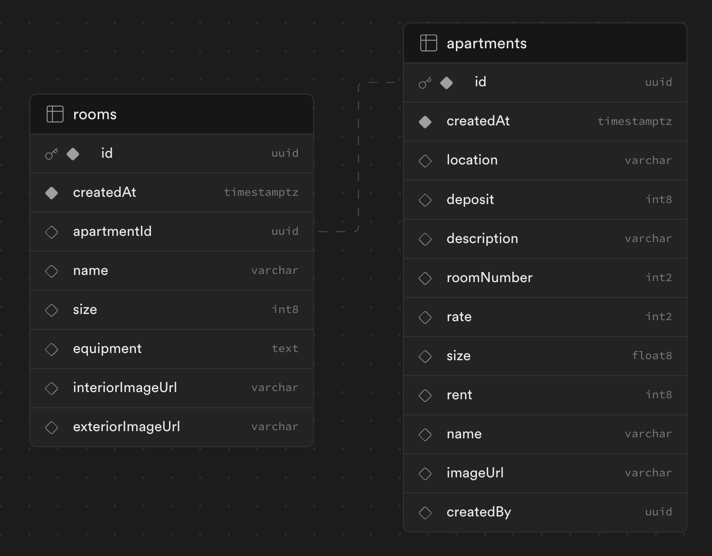

# Rooms!

Rooms! is a test application designed for `Friends in Flats`. It leverages the latest features of `Next.js` (including the App Router) and uses `Supabase` for database and storage management. The app is `fully dockerized`, facilitating deployment on any server and is `hosted on Vercel`.

## Features

- **Dark/Light Mode**: Easily switch between dark and light themes using the sun/moon icon in the top right corner of the toolbar.
- **Progressive Web App (PWA)**: Install the app on your mobile device for a seamless experience.
- **CI/CD**: Continuous Integration and Continuous Deployment processes streamline development and deployment.
- **Redux Integration**: Centralized state management via the `lib` folder.
- **Folder Routes**: Organized routes in the `app` folder, each with custom hooks and unit tests.
- **Reusable Components**: The `components` folder houses modular and maintainable components.
- **Styling**: Utilizes both Tailwind CSS and Material-UI for consistent theming.
- **Responsive Design**: The app is fully responsive, ensuring an optimal user experience across mobile, tablet, and desktop screens.

## Site Map

### Main View
On the main page, you'll see a list of advertised apartments, each represented by a card containing:
- Main photo
- Title
- Description
- Rating bar

### My Apartments
Access the 'My Apartments' section from the left drawer sidebar. This section allows users to:
- Create new apartment advertisements (login required).
- View previously created apartments.

### Apartment Details
Click on an apartment to view detailed information, including:
- Full description
- Prices
- Location
- Room details
- Image gallery

If you are the creator of the apartment, you can add or remove rooms; otherwise, the details are read-only.

## Database Information

The application uses two primary tables, linked via the `apartmentId` foreign key. 

### Permissions
- All users can read all data.
- Editing and deleting rooms are restricted to users with matching `createdBy` IDs for the apartment.

## Supabase Features
- **Storage**: Public image URLs are stored in the database.
- **Auth**: Email authentication is implemented.

## Access

### Online
Access the live application on Vercel: [Rooms! on Vercel](https://rooms-mersad-mgl-mersads-projects-f0dcecef.vercel.app)

### Docker Hub
The application is also available on Docker Hub: [Rooms! on Docker Hub](https://hub.docker.com/repository/docker/mersadmgl/rooms)

### Local Setup
To run the application locally:
1. Clone the repository.
2. Use the following commands:
  - `yarn dev`    # For development
  - `yarn build`  # To build the application
  - `yarn start`  # To start the application
  - `yarn lint`   # To lint the code

## Testing

The app includes both unit tests (using Jest) and end-to-end tests (using Cypress). Tests are integrated into the CI/CD pipeline.

To run tests locally:
- Unit tests: `yarn test`
- E2E tests: `yarn cypress` or `yarn test:e2e`

## TODO Tasks for Future

- **Server-Side Rendering (SSR)**: Currently, most components use client-side rendering. Implementing SSR for certain components and API calls can significantly improve the performance and load times of the application.

- **Increase Test Coverage**: The current test coverage is limited to some functions and components. Expanding the test coverage is essential to ensure the security and stability of the application, and to catch potential bugs early in the development process.

- **Search Functionality**: The search feature was initially an optional part of the project, intended to showcase query-making abilities. It uses Supabase's `.eq` function for queries. Implementing a comprehensive search functionality will include storing the search values in the URL and employing a debounce mechanism to optimize the user experience and reduce unnecessary database queries.
